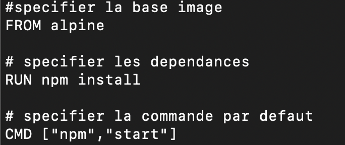

## Docker

Pourquoi utiliser Docker ?
- Rend facile, l'installation et le lancement d'un software. On a plus besoin d'installer le software et ensuite peut etre rencontrer un pb lors de l'installation, google l'erreur, la corriger, relancer l'installation pour ensuite avoir de nouveau une erreur etc ...

- Docker est un ecosysteme autour de la creation et le lancement de containers
- containers: instance d'une image, le container fait tourner le logiciel
- Image: un fichier avec toutes les dependances et configurations pour faire tourner un logiciel. Elle crée le container
- Docker Server: crée les images, les maintient, upload les images... c'est un daemon
- Docker CLI : client qui permet d'interagir avec le docker server
- docker run hello-world :
  - Docker Client contacte le docker server (daemon)
  - le daemon regarde dans Image cache si une image du nom de "hello-world" existe
  - Elle n'existe pas, il contacte "Docker Hub"
  - Docker Hub est le repository qui contient toutes les images
  - Daemon télécharge l'image depuis Docker Hub et la copie sur la machine dans Image cache
  - Daemon, charge l'image en mémoire, crée un container à partir de l'image et la lance

- **Fonctionnement de docker**
    - Des ressources(disque dur, RAm etc...) de l'ordi sont allouées au process des containers.
    - Le process du logiciel contacte le Kernel qui lui prend une partie du Disque dur, de la RAM etc pour faire tourner le process du logiciel.
    - Le Kernel existe que sur Linux, donc comment Docker fonctionne sur Mac et Windows
      - Docker install une Linux Virtual Machine

#### Commandes

|Commandes||
|-|-|
|**docker ps**|liste les containers en cours|
|**docker ps --all**   | liste tous les containers qui ont été crées et démarrés  |
|**docker system prune**   |  supprime les docker arrétés mais également le cache |
|**docker logs container_id**   | log du container meme si le container est arrété  |
| **docker stop container_id**  | Arrete le programme en envoyant un flag "SIGTERM" au process ds le container pour dire arrete le programme mais avant effectue qq taches (ex: cleanup, ou sauvegarde de fichier, envoie de msg ...)  |
|**docker kill container_id**   | Arrete le programme en envoyant un flag "SIGKILL" sans effectue d'autres taches => arret immédiat  |
|**docker exec -it container-id {command}**   | execute la commande dans le container. -it = -i -t = input text cad qu'on va pouvoir entrer du text et obtenir une reponse du terminal . -i = entrée du text -t = formater la sortie |
|**docker exec -it container-id sh**   | permet d'entrée dans le shell du container. "sh" peut etre remplacé par 4 types de shell : bash / powershell /zsh / sh (à choisir selon ses gouts) |

### Dockerfile

- image qui contient la configuration d'un container
- Dockerfile flow:
  - specifie une image
  - run des commandes pour ajouter des programmes en plus
  - Specifie la commande pour lancer le container

- creer une image : docker build . pour executer le Dockerfile
  -"FROM" : specie le docker ou l'image que l'on souhaite utiliser comme base
  - "RUN" : executer des commandes pendant que l'on construit notre image (ex: installation de dépendances ...)
  - "CMD": commande pour lancer le container
  - il y en a d'autres

- imaginer que l'on souhaite faire tourner Chrome sur un pc sans OS, voici les taches a faire. Dockerfile suis ce type de raisonnement
- Dans les logs de creation d'image on voit que des containers intermediaires sont crées. C est parce que:
  - FROM: télécharge l'image
  - RUN:
     - Utilise l'image et créer un container temporaire
     - éxécute les commandes prevus dans le RUN
     - prend un snapshot de ce container
     - eteind le container temporaire et rend disponible l'image pour l'instruction suivante
  - CMD: Utilise l'image  et créer un container temporaire
    - et dit au container qu'elle commande éxécuter quand il demarre
    - etaind le container temporaire et le rend disponible l'image pour l'instruction suivante

- creer l'image: **docker build .**
- nommer son image, lui donner un num et la tagguer:
  - **docker build -t kevin/redis:latest .** => kevin/redis sera le nom de l'image et on pourra faire docker run kevin/redis (au lieu d'utiliser son ID)
  - latest : c'est un numero de tag que l'on donne

- **hub.docker.com** => pour obtenir toutes les images officielles dispo dans l'ecosystem docker

### Creation d'un serveur nodeJS.
  - creation de deux fichier: package.json et index.js dans le meme repertoire que Dockerfile
  - 
  - en lancant ce Dockerfile, erreur car npm n'existe pas dans l'image alpine
  - soit il faut installer npm soit trouver une image qui contient deja alpine
  - sur hub.docker.com et en cherchant node, on voit plein de tags dont node:alpine qui contient deja npm
  - 
  - modification du FROM
  - en executant le Dockerfile, nouvelle erreur car npm install recherche package.json qui est sur ma machine et non dans le container
  - 
  - Ajout de **COPY** avant le RUN => copier les fichiers package.json et index.js présent sur la machine dans le working directory du container
  - cela fonctionne impec
  - docker run docker-id ou dockername
  - j'essaye depuis mon browser de me connecter au serveur port 8080 et ca echoue
  - pk? le container a ses propres ports et il n'y a aucn mapping de fait entre le port de ma machine et le port du container
  - **docker run -p 8080:8080 {docker-id ou name}** : cela fera le mapping entre le port 8080 de la machine et le port 8080 du container. (Chaque fois qu'une requete est faite sur le port 8080 de ma machine, elle est redirigée vers le port 8080 du container)
  - localhost:8080 => j'obtiens le message écrit dans index.js
  - /!\ : le working directory est "/" ce qui pose un enorme pb si par ex je souhaite copier un repertoire du nom de bin et que l'image installe par defaut un repertoire du mm nom
  - definir un working directory
  - 
  - Toutes les commandes en dessous de WORKDIR s'éxécute dans /usr/app du container.
  - les fichier index.js et package.json seront donc copiés la bas et le node_module obtenu par npm install aussi

### Docker Compose

- permet de gerer plusieurs containers
- permet de créer un/des network(s) pour que les containers communiquent entre eux.
- permet de ne pas réécrire des taches que l'on fait par Docker CLi
- **docker-compose.yml** : fichier qui centralise tous les containers que l'on souhaite créer + les actions que l'on suohaite faire sur chacun

Docker compose CLi

|Docker Compose Cli| Docker Cli|
|--|--|
|docker-compose up| docker run {myImage}|
|docker-compose up --build   | docker build .  docker run {myImage} |
|docker-compose down   | docker stop {mycontainer} |
|docker-compose ps (listeras tous les docker du docker-compose.yml qui tournent)  | docker ps (listera tous les dockers qui tournent)   |

A utiliser au mm endroit ou se trouve le fichier docker-compose.yml

- 
  - version => version de docker Compose
  - services: container que à créer
  - redis-server / node-app: nom des containers
    - image: image à utiliser pour creer le container. Image disponible dans docker hub
    - build: image à créer depuis un Dockerfile (image custom)
    - port: mapping entre le port de la machine et ceux du container comme avec "docker -p"

- les noms donnés au service servent de DNS. Chaque fois qu'on doit connecté une appli à une autre on peut juste donner le nom du service
- **docker-compose up -d**: lance le/les container et rend la main

  #### Restart Policy
- Pouvoir choisir lorsqu'un des container géré par docker-compose crash
  - ajouter la clé "restart" sur le service on applique la politique de redemarrage (cf: ligne 6)
  - 
  - "always": il y d 'autre policy ('no'/ on-failure/ unless-stopped)

#### Exercice

- faire une app que l'on push sur une branche, faire une pull request pour merger le code avec le master
- jouer les tests et deployer l'appli sur un server AWS

1) etape
   - nous avons recuperer un code JS qu'on appelle frontend
   - dans le répertoire frontend, création d'un Dockerfile nommé Dockerfile.dev => docker pour l'environnement de dev
   - 
   - ce conteneur fera tourner l'appli de dev
   - **docker build -f Dockerfile.dev .** : creer une image à partir d'un fichier avec un nom different de Dockerfile
   - ou ajouter dans le docker-compose.yml
   - 

2) Comment modifier du code de notre app sans recréer d'image?
   - en utilisant les **volume**
   - **docker run -p 3000:3000 -v /app/node_module -v $(pwd):/app {container_id}**
     - **-v $(pwd):/app**: faite la mapping entre le dossier courant de ma machine et le dossier /app du container (dossier ou se trouve l'appli)
     - **-v /app/node_module**: Sur ma machine, ce dossier n'existe pas car il est généré par la commande npm install. Ici on dit, ne fait pas de mapping avec node_module. Sans ca, lorsqu'on demarre le container, il y a une erreur car il essaye de faire le mapping avec un dossier en local mais ne le trouve pas
     - Du coup, si je modifie un fichier en local, cela impactera directement le container

3) Comment builder le projet et le lancer depuis un serveur web à l'interieur d'un docker ?
  - utilisation de Nginx comme serveur web
  - creation d'un nouveau dockerfile nommé Dockerfile (comme d'hab)
  - 
    - division du docker en phase, il y a deux phases, la premiere nommée builder et la second sans nom qui traite de Nginx server
    - la phase builder compile le projet et le code compilé et les dépendances sont sauvegardés dans le repertoire build.
    - ce répertoire est copié dans le répertoire qui déploie les appli sur Nginx
    - --from=builder utile car les deux phases créées un container différent

4) Utiliser Travis CI pour l'intégration continue
  - connecter le compte github à Travis CI et créer le fichier travis.yml
  - 
  - création d'un fichier ".travis.yml" dans notre projet et le pusher
  
    - sudo: required: hey travis on a besoin du super level permission pour executer le build
    - on a besoin de docker et voici la commande à éxecuter avant (on nomme l appli reactApp)
    - utilisation de Dockerfile.dev car c'est dans ce fichier qu'on dit de runner les tests
  - Travis, connecté au repo du projet va cloner le repository et lire le fichier .travis.yml.
  - va éxécuter Dockerfile.dev et donc creer une image appelée reactapp
  - et démarrer le container en executant les tests
  Ici le run ne lancera pas la commande définie dans le Dcokerfile mais éxécutera la commande des test => override le run en qualque sorte

5) pour pusher le code sur AWS depuis travis
   - pusher le code sur docker hub, docker hub nous sert également de repository perso (comme github) mais destiné au image Docker.
   - connecter AWS à notre repo docker
   - pour cela on utilise un json propre à AWS **Dockerrun.aws.json**
   - 
     - ici on a plusieur docker à gerer qui ont ete uploadés dans le repo de docker hub.
     - image: nom donné au build de l'image et qui apparait dans le repo
     - hostname: DNS que l'on donne au docker. Tous les autre docker de notre ecosysteme pour l'appeler en utilisant ce hostname
     - essential: s'il ne build pas, le suivant ne sera pas demarré
